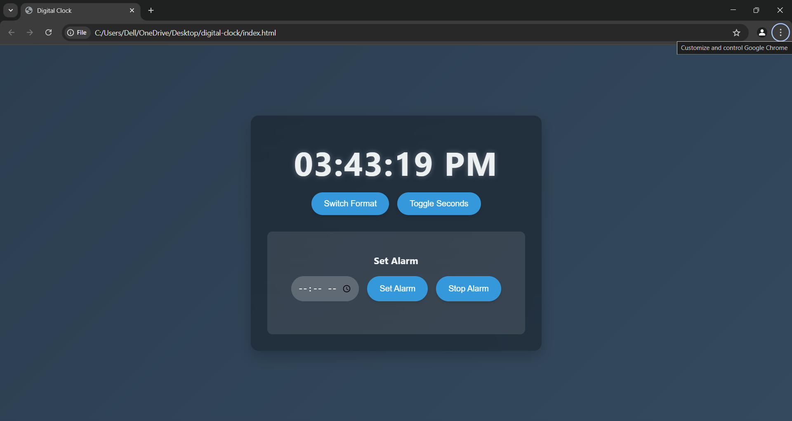

# Live Clock

## Overview
Live Clock is a simple real-time clock application that displays the current time dynamically. It is designed to provide an accurate, constantly updating clock with a clean user interface.

## Features
- Displays real-time updates of the current time.
- User-friendly interface.
- Lightweight and efficient.
- Built using HTML, CSS, and JavaScript.

## Screenshots
Below are screenshots of the Live Clock application:

### Home Screen



### Running Clock


## Installation
To set up the project locally, follow these steps:

1. Clone the repository:
   ```sh
   git clone https://github.com/sapan-khadka/Live-Clock.git
   ```
2. Navigate to the project directory:
   ```sh
   cd Live-Clock
   ```
3. Open `index.html` in a web browser.

## Usage
- After opening `index.html`, the clock will start displaying the current time.
- The time updates every second to ensure accuracy.

## Technologies Used
- **HTML**: Structure of the application.
- **CSS**: Styling for the clock interface.
- **JavaScript**: Logic for updating the time dynamically.

## Code Structure
The project consists of the following main files:

- `index.html` - The main HTML file containing the structure of the clock.
- `style.css` - Contains the styles for a visually appealing clock display.
- `script.js` - JavaScript file that updates the time dynamically.

## Contributing
If you'd like to contribute:
1. Fork the repository.
2. Create a new branch for your feature:
   ```sh
   git checkout -b feature-name
   ```
3. Make changes and commit:
   ```sh
   git commit -m "Add new feature"
   ```
4. Push to your fork and submit a pull request.
